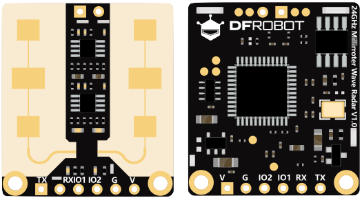

# DFR_Radar Library for Arduino

[](https://github.com/MaffooClock/DFR_Radar/actions/workflows/check-arduino.yml)  [](https://github.com/MaffooClock/DFR_Radar/actions/workflows/compile-examples.yml)  [](https://www.ardu-badge.com/DFR_Radar)  [](https://registry.platformio.org/libraries/maffooclock/DFR_Radar)

This is a maintained version of the [original DFRobot_mmWave_Radar](https://github.com/DFRobotdl/DFRobot_mmWave_Radar) library.  After more than two years had passed without any commits beyond the initial commit, and issues receiving no attention, I assumed that it had become abandonware, so decided to fork this library to bring it up-to-date and get it published into the Arduino Library and PlatformIO Registry.

The SEN0395 24GHz millimeter-wave Human Presence Detection sensor (available from [DFRobot.com](https://www.dfrobot.com/product-2282.html)) is a fantastic device that works well, is software-configurable, and didn't deserve to be crippled by an unfinished library.


## Table of Contents

* [About the SEN0395](#about-the-sen0395)
* [Installation](#installation)
* [Methods](#methods)
* [Compatability](#compatability)
* [Credits](#credits)


## About the SEN0395



This 24GHz millimeter-wave radar sensor employs a [frequency-modulated continuous-wave (FMCW) radar](https://en.wikipedia.org/wiki/Continuous-wave_radar#Modulated_continuous-wave) featuring multi-mode modulation and separate transmit and receive antennas.

The radar sensor can detect human presence within a configurable detection area, both in motion and stationary -- it can even detect a person breathing.  Whereas a person might be able to "fool" a traditional PIR motion sensor simply by remaining still, or even walking very slowly, FMCW radar can detect this easily.

> [!NOTE]
> This library is not required to make this sensor work with your Arduino.  All you need are connections to V (3.3-5V), G (Ground), and IO2 (Signal Out).  However, if you connect the RX and TX pins, you can use this library to configure various settings and tweak its behavior to suit your needs.


### Additional Notes

There are a number of things that the [official wiki page](https://wiki.dfrobot.com/mmWave_Radar_Human_Presence_Detection_SKU_SEN0395) does not address, or the information provided is incomplete or unclear, so following is a list of supplimentary bullet points:

 1. **IO2 Pin** - By default, this pin remains LOW when idle and goes HIGH when presence has been detected.  This library allows you to invert this behavior, and also provides a method for configuring delays for changes between these states, which can help prevent or reduce false-positives or short-cycling.

 2. **Power** - Make sure you use a clean and stable power supply with less than 100mV of ripple, otherwise presence detection could be affected, including false triggers.

 3. **Start-up Delay** - There's about a 5-second delay from the time the sensor is powered-on until it begins to actually sense presence.  This is due to the sensor performing initialization and self-calibration tasks, so presence detection will not occur until after this.

 4. **Triggers: Transitional vs. Sustained** - After the sensor has been triggered by presence, "micro-movements" such as breathing or even moving a finger can be enough to sustain the triggered state.  However, those same micro-movements may not be enough to fully trigger the sensor from an idle state.  The sensitivity and trigger latency settings have a significant effect on this.


## Installation

This library is available in both the Arduino Library Manager and the PlatformIO Registry.


#### Arduino IDE:

There are multiple ways, but three of those are below (pick **one**, don't do all three!):

 - Search the Library Manager for `DFR_Radar`

 - Use the command line interface:
   ```shell
   arduino-cli lib install DFR_Radar@1.1.0
   ```

 -  Manual install: download the [latest release](https://github.com/MaffooClock/DFR_Radar/releases/latest), then see the documentation on [Importing a .zip Library](https://docs.arduino.cc/software/ide-v1/tutorials/installing-libraries#importing-a-zip-library).


#### PlatformIO:

There are multiple ways, but three of those are below (pick **one**, don't do all three!):

 - Search the [Library Registry](https://registry.platformio.org/search?t=library) for `MaffooClock/DFR_Radar` and install it automatically.

 - Edit your [platformio.ini](https://docs.platformio.org/en/latest/projectconf/index.html) file and add `MaffooClock/DFR_Radar@^1.1.0` to the [`lib_deps`](https://docs.platformio.org/en/latest/projectconf/sections/env/options/library/lib_deps.html) stanza.

 - Use the command line interface:
   ```shell
   cd MyProject
   pio pkg install --library "MaffooClock/DFR_Radar@^1.1.0"
   ```


### Include the Header

Finally, just add `#include <DFR_Radar.h>` to the top of your project (below `#include <Arduino.h>` if it exists).


## Methods

_Documentation update in progress..._


## Compatibility

Although the SEN0395 and this library _should_ work on nearly any Arduino-compatible microcontroller, I have personally tested each one of these to confirm that they do work:

 * Arduino Uno (ATmega328P)
 * Arduino Nano Every (ATmega4809)
 * Arduino Mega R3 (ATmega2560)
 * Arduino Due (AT91SAM3X8E)
 * Arduino Nano ESP32 (ESP32-S3)
 * Generic "ESP32 DEVKIT V1" (ESP-WROOM-32)
 * Seeeduino Xiao (SAMD21)
 * Teensy 4.x/MicroMod (iMXRT1062)


## Credits

Originally written by huyujie (yujie.hu@dfrobot.com) in 2020 and published at [DFRobotdl/DFRobot_mmWave_Radar](https://github.com/DFRobotdl/DFRobot_mmWave_Radar).

Forked and updated by [Matthew Clark](https://github.com/MaffooClock) in November 2023.

